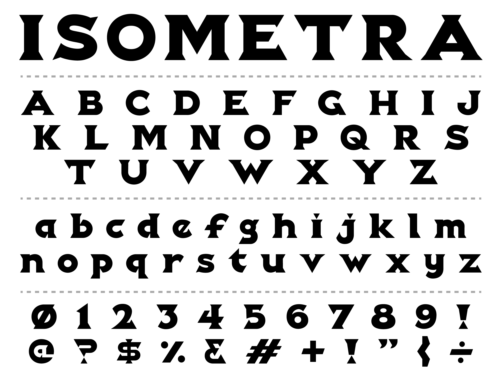
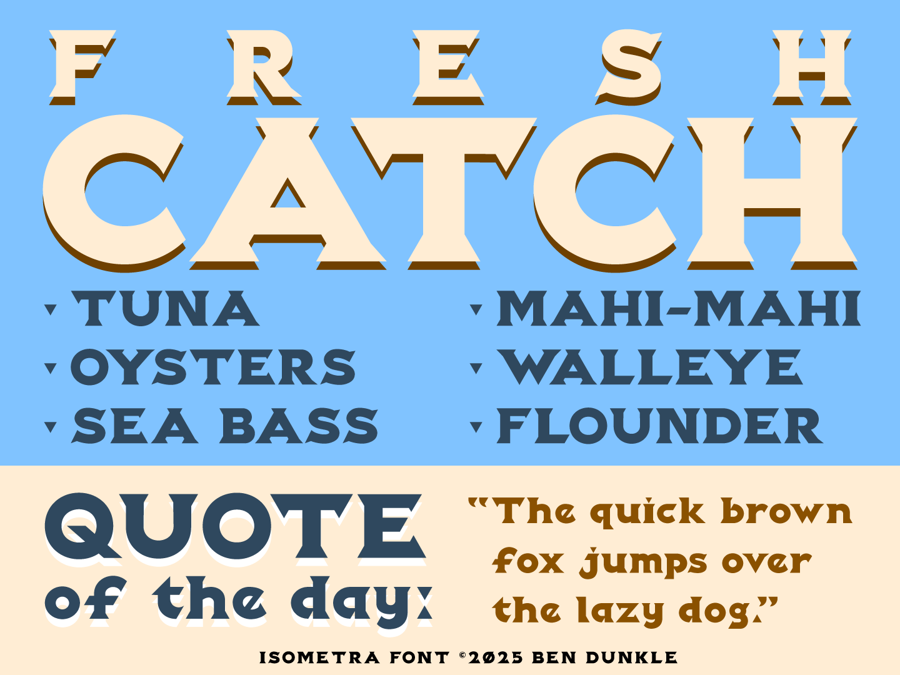

# Isometra

**Ben Dunkle**
*SIL Open Font License 1.1,*
*1 font, +128 glyphs.*

Isometra is a slab-serif styled font that conforms loosely to a 60 degree isometric grid. It is bold by design. It has a sophisticated, authentic feel. It is ideal for signage, titles or logos.

### Designer

* Ben Dunkle

### License

Copyright (c) 2025, Ben Dunkle (bendunkle.com | bendunkle@gmail.com)

Licensed under the [*SIL Open Font License, 1.1*](http://scripts.sil.org/OFL); you may not use this file except in compliance with the License.

======

*To contribute to the project contact Ben Dunkle at bendunkle@gmail.com*